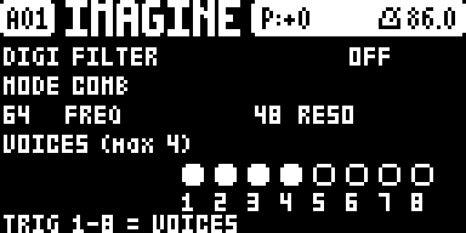
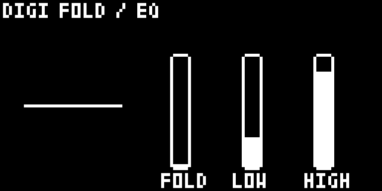

# Tone+FX

**A master effect suite for the Elektron Digitone mk1 / Digitone Keys (OS 1.43).**

Tone+FX is a set of [elekloader](https://github.com/irpina/elekloader) mods,
**packaged and released together as one suite**. It adds master ring modulation,
a tone-tilt EQ, a wavefolder, a per-voice multimode filter, output metering and a
three-page UI on the master page tree.

This repository is **release-only**: it ships the built `.elemod` packages and
the docs to install them. It contains **no source and no firmware**. The source
lives in the development repo, so this repo stays a safe place to cut releases
from while the older `RingTone` repo is still around.

> Unofficial and unsupported. Not affiliated with, endorsed by or supported by
> Elektron. Flashing modified firmware is at your own risk.

## Screenshots





## The suite

| package | what |
|---|---|
| `core-dn1-2.0a.elemod` | the required core (the hook bus) — **always install this** |
| `digimeter-1.1.elemod` | output level metering (drawn on the DIGI FX page) |
| `digieq-1.1.elemod` | master tone tilt (low / high band gain) |
| `digiring-1.1.elemod` | master ring modulator / tremolo, with an animated page |
| `digifold-1.1.elemod` | master wavefolder (triangle fold), with a spiral display |
| `digifilter-1.0.elemod` | per-voice filter: BP / BP2 / COMB / TRASH on up to 4 voices |
| `digictl-1.6.elemod` | the DIGI pages and all the controls for the above; keeps the settings per pattern |

`digictl` requires the other five, so they install as a **set**. Everything is
`GPL-2.0-or-later` (see [`LICENSE`](LICENSE)).

## Install

1. Get **elekloader** and your own stock
   `Digitone_and_Digitone_Keys_OS1.43.syx` (Elektron's download). elekloader
   builds a custom OS on your machine; it never distributes firmware.
2. In elekloader's window, add the stock `.syx`, then **+ Install from file…**
   and pick all seven `.elemod`s from [`elemods/`](elemods/).
3. Tick them all (or the whole set), set the OS version tag, and **BUILD
   FIRMWARE**.
4. Flash the resulting `.syx` with Elektron Transfer, as for any OS update;
   press **YES** on the unit and do not power off until it finishes.

Or from the command line (elekloader from source):

```powershell
# Windows PowerShell
./tools/build.ps1 -Stock "Digitone_and_Digitone_Keys_OS1.43.syx" -Out ToneFX.syx -Version 2.2a
```

```sh
# POSIX
sh tools/build.sh Digitone_and_Digitone_Keys_OS1.43.syx ToneFX.syx 2.2a
```

**Recovery** (the bootloader is never changed): hold **FUNC** while powering on
for the startup menu, press **TRIG 4 (OS UPGRADE)**, then send the stock `.syx`
with Transfer's legacy OS upgrade mode.

## Use

The pages live on the **master page tree**: **FUNC + LFO** cycles the master
pages. Tone+FX appends three of its own after the stock ones:

- **DIGI FX** — **RING** only: **A** on/off, **B** depth, **C** frequency,
  **LEVEL** = meter. A low-CPU ring animation; depth and frequency as vertical
  bars on the right.
- **DIGI FILTER** — **A** on/off, **B** mode (BP / BP2 / COMB / TRASH),
  **C** frequency, **D** resonance, **E/F** all voices on/off; **trig keys 1–8**
  route/unroute voices. At most **4 voices** are filtered at once.
- **DIGI FOLD / EQ** — **A** FOLD on/off, **B** FOLD amount (a spiral that is a
  straight line at 0 and coils as it folds), **C** EQ LOW on/off, **D** EQ LOW
  amount, **E** EQ HIGH on/off, **F** EQ HIGH amount.

On those pages, **LEFT / RIGHT** rotate the three pages. Every parameter is
**0–127** and moves **one step per notch** — the stock convention (EQ LOW/HIGH
are 0–127 with **64 = flat**; filter FREQ/RESO are 0–127 too). PAGE and every
stock key keep their stock meaning.

**The settings are stored per pattern** (inside the saved pattern data): they
follow a pattern switch / reload and travel with a project save, like stock
parameters.

Signal order on the master mix is **ring → EQ → fold**; the filter runs
per-voice, before the mix. Ring, EQ and fold are on by default; the filter is
off until you enable it.

### Load — yours to manage

The Digitone's **CPU and DSP are shared** between the internal FM voices and
these added effects. Running **everything at once** — ring + EQ + fold **and**
the filter's **COMB / TRASH** on several voices — **will stress the CPU/DSP**
and can cause dropouts. Manage it yourself: turn off what you are not using,
keep the routed filter voices low (the filter is capped at **4 voices**), and
back off RESO / depth on busy patterns.

## Releases

- `elemods/` at the repository root is the **current release** (this is what
  [`SHA256SUMS`](SHA256SUMS) covers).
- [`releases/`](releases/) holds a **packaged copy of each cut release**
  (`README`, `CHANGELOG`, `LICENSE`, `SHA256SUMS`, `elemods/`, `tools/`,
  `Screenshots/` and the `.zip`), newest first.
- [`archive/`](archive/) holds **superseded releases** (e.g. `2.1h`).

## Verify a download

```sh
sha256sum -c SHA256SUMS        # or: Get-FileHash elemods/* -Algorithm SHA256
```

## Status

**Work in progress**, emulator-tested. Current package versions are listed in
[`CHANGELOG.md`](CHANGELOG.md). No firmware is included or distributed here; the
`.elemod`s carry only our own code and patch sites (byte-checked against your
stock file at build time).

Maintainers: see [`RELEASING.md`](RELEASING.md) for how to cut the next release.
