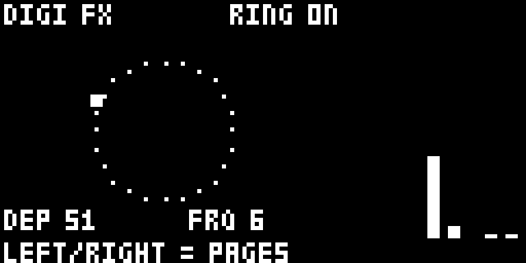

# Tone+FX

**A master effect suite for the Elektron Digitone mk1 / Digitone Keys (OS 1.43).**

Tone+FX is a set of [elekloader](https://github.com/irpina/elekloader) mods,
**packaged and released together as one suite**. It adds master ring modulation,
a tone-tilt EQ, a wavefolder, a per-voice multimode filter, output metering and a
three-page UI on the master page tree.

This repository is **release-only**: it ships the built `.elemod` packages and
the docs to install them. It contains **no source and no firmware**. The source
lives in the development repo, so this repo stays a safe place to cut releases
from while the older `RingTone` repo is still around.

> Unofficial and unsupported. Not affiliated with, endorsed by or supported by
> Elektron. Flashing modified firmware is at your own risk.

## Screenshots




## The suite

**One file is the whole suite:** [`elemods/tonefx-2.3b.elemod`](elemods/) bundles
every mod below into a single elekloader mod, so it **combines with your other
mods**. It does **not** include the required core — install `core-dn1-2.0a.elemod`
too (elekloader provides it), plus anything else you use.

- **digimeter** — output level metering (drawn on the DIGI FX page).
- **digieq** — master tone tilt (low / high band gain).
- **digiring** — master ring modulator / tremolo, with an animated page.
- **digifold** — master wavefolder (triangle fold), with a spiral display.
- **digifilter** — per-voice filter: BP / BP2 / COMB / TRASH on up to 4 voices.
- **digictl** — the DIGI pages and all the controls; keeps the settings per
  pattern and adds MIDI CC control.

Everything is `GPL-2.0-or-later` (see [`LICENSE`](LICENSE)).

## Install

1. Get **elekloader** and your own stock
   `Digitone_and_Digitone_Keys_OS1.43.syx` (Elektron's download). elekloader
   builds a custom OS on your machine; it never distributes firmware.
2. In elekloader's window, add the stock `.syx`, then **+ Install from file…**
   and pick `core-dn1-2.0a.elemod` (the required core; elekloader ships it) and
   `tonefx-2.3b.elemod` (the whole suite). Add any of your other mods too.
3. Tick the core and `tonefx`, set the OS version tag, and **BUILD FIRMWARE**.
4. Flash the resulting `.syx` with Elektron Transfer, as for any OS update;
   press **YES** on the unit and do not power off until it finishes.

Or from the command line (elekloader from source):

```powershell
# Windows PowerShell
./tools/build.ps1 -Stock "Digitone_and_Digitone_Keys_OS1.43.syx" -Out ToneFX.syx -Version 2.3b
```

```sh
# POSIX
sh tools/build.sh Digitone_and_Digitone_Keys_OS1.43.syx ToneFX.syx 2.3b
```

**Recovery** (the bootloader is never changed): hold **FUNC** while powering on
for the startup menu, press **TRIG 4 (OS UPGRADE)**, then send the stock `.syx`
with Transfer's legacy OS upgrade mode.

## Use

The pages live on the **master page tree**: **FUNC + LFO** cycles the master
pages. Tone+FX appends three of its own after the stock ones:

- **DIGI FX** — **RING** only: **A** on/off, **B** depth, **C** frequency,
  **LEVEL** = meter. A low-CPU ring animation; depth and frequency as vertical
  bars on the right.
- **DIGI FILTER** — **A** on/off, **B** mode (BP / BP2 / COMB / TRASH),
  **C** frequency, **D** resonance, **E/F** all voices on/off; **trig keys 1–8**
  route/unroute voices. At most **4 voices** are filtered at once.
- **DIGI FOLD / EQ** — **A** FOLD on/off, **B** FOLD amount (a spiral that is a
  straight line at 0 and coils as it folds), **C** EQ LOW on/off, **D** EQ LOW
  amount, **E** EQ HIGH on/off, **F** EQ HIGH amount.

On those pages, **LEFT / RIGHT** rotate the three pages. Every parameter is
**0–127** and moves **one step per notch** — the stock convention (EQ LOW/HIGH
are 0–127 with **64 = flat**; filter FREQ/RESO are 0–127 too). PAGE and every
stock key keep their stock meaning.

**The settings are stored per pattern** (inside the saved pattern data): they
follow a pattern switch / reload and travel with a project save, like stock
parameters.

**MIDI CC control:** the DIGI FX also respond to **incoming MIDI CC** — RING
depth/rate/on, FOLD amount/on, EQ LOW/HIGH (gain + on/off) and the filter (on,
mode, freq, reso) — on a set of CC numbers the Digitone does not use, so they
can be played and sequenced from an external controller/DAW. A **CC move is
saved with the pattern**, like a page edit. Only CCs the stock DN does not use
are taken; every other CC falls through to the stock handler untouched.

| CC | parameter | CC | parameter |
|---|---|---|---|
| `8` | RING depth | `69` | EQ LOW gain |
| `11` | RING on/off | `96` | EQ HIGH gain |
| `36` | RING rate | `97` | FILTER on/off |
| `37` | FOLD on/off | `100` | FILTER mode |
| `40` | FOLD amount | `101` | FILTER freq |
| `67` | EQ LOW on/off | `103` | FILTER reso |
| `68` | EQ HIGH on/off | | |

On/off switches at value **64**; EQ LOW/HIGH are 0–127 with **64 = flat**;
FILTER mode maps the full range onto BP / BP2 / COMB / TRASH. Incoming CCs on
**any** MIDI channel drive the (global) master FX. The method (the hooked stock
CC router `0x400ED94E`, the `jmp` requirement) is in the source repo's
`docs/MIDI-CC.md`.

Signal order on the master mix is **ring → EQ → fold**; the filter runs
per-voice, before the mix. Ring, EQ and fold are on by default; the filter is
off until you enable it.

### Load — yours to manage

The Digitone's **CPU and DSP are shared** between the internal FM voices and
these added effects. Running **everything at once** — ring + EQ + fold **and**
the filter's **COMB / TRASH** on several voices — **will stress the CPU/DSP**
and can cause dropouts. Manage it yourself: turn off what you are not using,
keep the routed filter voices low (the filter is capped at **4 voices**), and
back off RESO / depth on busy patterns.

## Releases

- `elemods/` at the repository root is the **current release** (this is what
  [`SHA256SUMS`](SHA256SUMS) covers).
- [`releases/`](releases/) holds a **packaged copy of each cut release**
  (`README`, `CHANGELOG`, `LICENSE`, `SHA256SUMS`, `elemods/`, `tools/`,
  `Screenshots/` and the `.zip`), newest first.
- [`archive/`](archive/) holds **superseded releases** (e.g. `2.1h`).

## Verify a download

```sh
sha256sum -c SHA256SUMS        # or: Get-FileHash elemods/* -Algorithm SHA256
```

## Status

**Stress-tested on real hardware** (a Digitone mk1): the full suite boots and
holds up under long, busy patterns, and the per-pattern settings survive
pattern switches, reloads and power cycles. Also tested in the **digiemu**
emulator (boot, settle, `dsp_running=2`). Current package versions are listed in
[`CHANGELOG.md`](CHANGELOG.md). No firmware is included or distributed here; the
`.elemod`s carry only our own code and patch sites (byte-checked against your
stock file at build time).

## Known bugs / future fixes

- **Slider behaviour:** the page faders/bars should track the stock parameter
  widgets more closely (EQ fill from the centre, shared smoothing, value
  readouts).
- **Encoder acceleration:** match the stock fast-turn curve per parameter
  (currently one step per notch plus whatever acceleration the OS delivers).
- **LFO destinations:** driving the DIGI parameters from a track LFO is
  **parked** — the bridge is in the code but off, with no page control.
- **UI improvements:** consistent titles/units across the three pages and
  per-parameter value readouts.
- **CPU/DSP load** is the user's to manage (see *Load* above).
