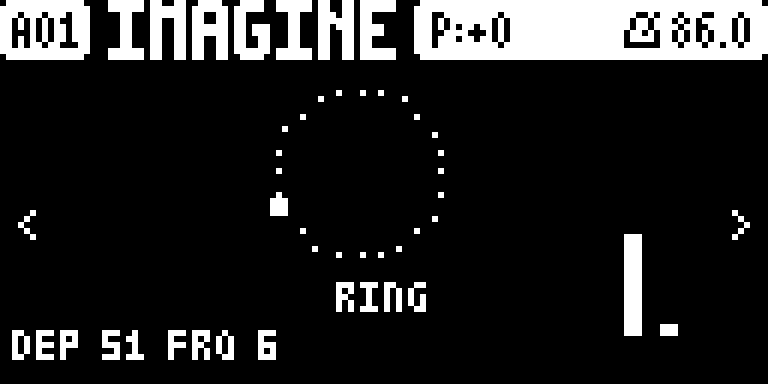
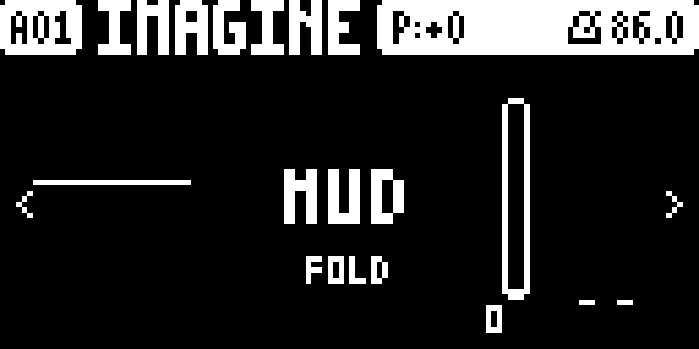
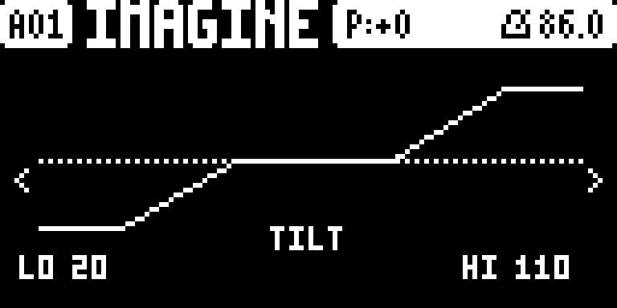

# Tone+FX

**A master effect suite for the Elektron Digitone mk1 / Digitone Keys (OS 1.43).**

Tone+FX is a set of [elekloader](https://github.com/irpina/elekloader) mods,
**packaged and released together as one suite**. It adds master ring modulation,
a low/high-shelf EQ, a wavefolder with four fold modes (plus an internal
overdrive), output metering and a three-page UI on the master page tree.

This repository is **release-only**: it ships the built `.elemod` packages and
the docs to install them. It contains **no source and no firmware**. The source
lives in the development repo, so this repo stays a safe place to cut releases
from while the older `RingTone` repo is still around.

> Unofficial and unsupported. Not affiliated with, endorsed by or supported by
> Elektron. Flashing modified firmware is at your own risk.

## Screenshots





## The suite

**One file is the whole suite:** [`elemods/tonefx-3.0a.elemod`](elemods/) bundles
every mod below into a single elekloader mod, so it **combines with your other
mods**. It does **not** include the required core — install `core-dn1-2.0a.elemod`
too (elekloader provides it), plus anything else you use.

- **digimeter** — output level metering (drawn on the DIGI FOLD page).
- **digieq** — master low-shelf / high-shelf EQ (LO + HI knobs).
- **digiring** — master ring modulator / tremolo, with an animated page.
- **digifold** — master wavefolder with CLEAN / MUD / DIST / TRSH fold modes and
  an internal overdrive; a spiral display.
- **digictl** — the DIGI pages and all the controls; keeps the settings per
  pattern and adds MIDI CC control.

Everything is `GPL-2.0-or-later` (see [`LICENSE`](LICENSE)).

## Install

1. Get **elekloader** and your own stock
   `Digitone_and_Digitone_Keys_OS1.43.syx` (Elektron's download). elekloader
   builds a custom OS on your machine; it never distributes firmware.
2. In elekloader's window, add the stock `.syx`, then **+ Install from file…**
   and pick `core-dn1-2.0a.elemod` (the required core; elekloader ships it) and
   `tonefx-3.0a.elemod` (the whole suite). Add any of your other mods too.
3. Tick the core and `tonefx`, set the OS version tag, and **BUILD FIRMWARE**.
4. Flash the resulting `.syx` with Elektron Transfer, as for any OS update;
   press **YES** on the unit and do not power off until it finishes.

Or from the command line (elekloader from source):

```powershell
# Windows PowerShell
./tools/build.ps1 -Stock "Digitone_and_Digitone_Keys_OS1.43.syx" -Out ToneFX.syx -Version 3.0a
```

```sh
# POSIX
sh tools/build.sh Digitone_and_Digitone_Keys_OS1.43.syx ToneFX.syx 3.0a
```

**Recovery** (the bootloader is never changed): hold **FUNC** while powering on
for the startup menu, press **TRIG 4 (OS UPGRADE)**, then send the stock `.syx`
with Transfer's legacy OS upgrade mode.

## Use

The pages live on the **master page tree**: **FUNC + LFO** cycles the master
pages. Tone+FX appends three of its own after the stock ones. **LEFT / RIGHT**
(or the on-screen `<` `>` arrows) rotate the whole master page list. The stock
**top status bar** (pattern name, tempo, …) stays visible above every page.

| page | encoders | shows |
|---|---|---|
| **RING** | **A** on/off · **E** depth · **F** frequency | a centred ring animation, the depth/frequency bars on the right and the values bottom-left |
| **FOLD** | **A** on/off · **D** fold type · **E/F/G/H** amount | the spiral (left), the big mode title, the amount as a vertical slider next to the L/R meter |
| **TILT** | **A** on/off · **E** low shelf · **H** high shelf | a bent low/high response curve |

Every parameter is **0–127** and moves **one step per notch** — the stock
convention (EQ LOW/HIGH are 0–127 with **64 = flat**). PAGE and every stock key
keep their stock meaning.

**The settings are stored per pattern** (inside the saved pattern data): they
follow a pattern switch / reload and travel with a project save, like stock
parameters.

### Fold type (FOLD, encoder D)

The wavefolder's *fold type* is a continuous **0–127** knob spread over four
modes; turning it sweeps smoothly between them (interpolated) and caps at CLEAN
(min) and TRSH (max):

| mode | fold range | overdrive |
|---|---|---|
| **CLEAN** | 36% | off |
| **MUD** | full (the original folder) | off |
| **DIST** | 36% | hard-clip overdrive |
| **TRSH** | full | hard-clip overdrive |

The overdrive is a cheap stateless saturation (a gain into a clamp), applied
only in DIST/TRSH, so CLEAN/MUD cost nothing extra per sample.

### MIDI CC control

All the FX parameters respond to **incoming MIDI CC** on a set of numbers the
Digitone does not use, so they can be played and sequenced from an external
controller/DAW. A **CC move is saved with the pattern**, like a page edit. Only
CCs the stock DN does not use are taken; every other CC falls through to the
stock handler untouched.

| CC | parameter | CC | parameter |
|---|---|---|---|
| `8` | RING depth | `41` | FOLD type |
| `11` | RING on/off | `67` | EQ on/off |
| `36` | RING rate | `68` | meter on/off |
| `37` | FOLD on/off | `69` | EQ low shelf |
| `40` | FOLD amount | `96` | EQ high shelf |

On/off switches at value **64**; EQ LOW/HIGH are 0–127 with **64 = flat**; the
FOLD type is 0–127. Incoming CCs on **any** MIDI channel drive the master FX.
The method (the hooked stock CC router `0x400ED94E`, the `jmp` requirement) is in
the source repo's `docs/MIDI-CC.md`.

Signal order on the master mix is **ring → EQ → fold**, then the meter. Ring, EQ
and fold are on by default.

### Load — yours to manage

The Digitone's **CPU and DSP are shared** between the internal FM voices and
these added effects. Running everything at once **can stress the CPU/DSP** and
cause dropouts on busy patterns. Manage it yourself: turn off what you are not
using and back off ring depth / fold amount on busy patterns.

## Releases

- `elemods/` at the repository root is the **current release** (this is what
  [`SHA256SUMS`](SHA256SUMS) covers).
- [`releases/`](releases/) holds a **packaged copy of each cut release**
  (`README`, `CHANGELOG`, `LICENSE`, `SHA256SUMS`, `elemods/`, `tools/`,
  `Screenshots/` and the `.zip`), newest first.
- [`archive/`](archive/) holds **superseded releases** (e.g. `2.1h`).

## Verify a download

```sh
sha256sum -c SHA256SUMS        # or: Get-FileHash elemods/* -Algorithm SHA256
```

## Status

**Stress-tested on real hardware over 3 days: PASS** (a Digitone mk1): the full
suite boots and holds up under long, busy patterns, and the per-pattern settings
survive pattern switches, reloads and power cycles. Also tested in the
**digiemu** emulator (boot, settle, `dsp_running=2`). Current package versions
are listed in
[`CHANGELOG.md`](CHANGELOG.md). No firmware is included or distributed here; the
`.elemod`s carry only our own code and patch sites (byte-checked against your
stock file at build time).

## Known bugs / future fixes

- **Slider behaviour:** the page sliders/bars should track the stock parameter
  widgets more closely (shared smoothing, value readouts).
- **Encoder acceleration:** the base rate now matches stock (one step per
  detent); the fast-turn curve is whatever the OS driver delivers.
- **LFO destinations:** driving the DIGI parameters from a track LFO is
  **parked** — the bridge is in the code but off, with no page control.
- **UI improvements:** consistent titles/units across the three pages and
  per-parameter value readouts.
- **CPU/DSP load** is the user's to manage (see *Load* above).
